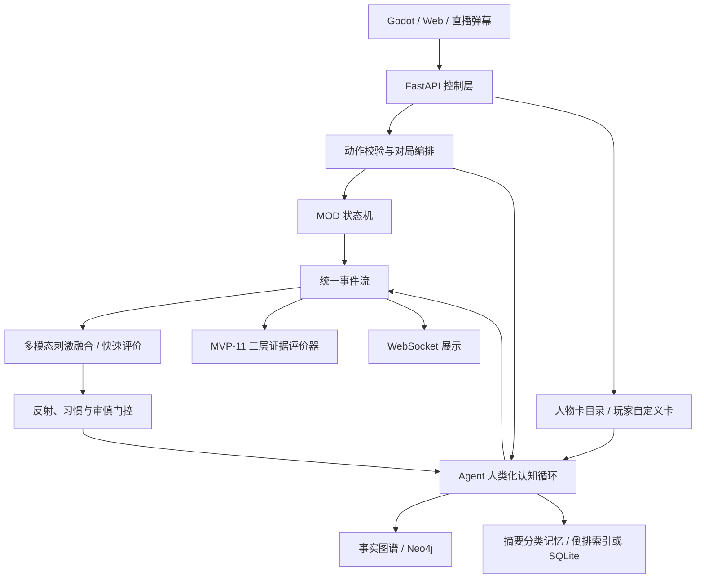

# 架构说明

## 运行边界

核心域不依赖 FastAPI 或 Godot。MOD 接收状态、行动与可复现随机源，返回新状态和领域事件；这使规则可以独立测试、回放和部署。

Agent 认知循环升级为 `观察 → 评价/应对 → 慢变量人物动力更新 → 情境人格激活 → 显著性记忆检索 → 社会信念 → 持续计划 → 快/慢有限理性决策 → 内在状态/公开表达分离 → 合法性硬校验 → 结果记忆、后果遗留与证据反思`。心理矩阵包括信心、士气、压力、沮丧、愤怒、恐惧、疲劳、不确定性和社会信任；这些状态直接进入动作效用，而不是只用于展示。慢变量人物动力保存竞争动机、承诺、秘密压力、身份失调、怨恨、羞耻、道德创伤、希望、依恋和人物弧光，使经历对后续选择产生迟滞。MVP-6 加入冲动压力、社会易感性和自我许可；MVP-7 再把每个合法行动的价值、关系、承诺、即时收益、不可逆性与延迟风险标准化为叙事可供性。选择形成债务并排入延迟后果队列，两次后续决策后才成熟，从而让角色无法在下一句台词里无成本地重置立场。所有因素仍只能偏置合法动作。社交 MOD 可以把多个合法宏观策略按连续权重混合，规则层校验主要策略和所有混合分量后再计算后果。

隐式控制层把观察入口扩展为语言、视觉、听觉、触觉、身体感受、回忆、幻想和权威世界事件。输入先规范化为带认识状态的 `StimulusEvent`，经过短时间融合与快速评价后产生身体线索，再由审慎门控判断是否调用 LLM。幻想、记忆、观察和推断可以影响情绪与行动倾向，但只有权威事件可进入事实层；公开身体线索与私有触发诊断分流。后天技能沿 `novel → guided → practiced → automatic` 成长，连续失败可进入 `degraded`；只有具有足够成功证据且当前路线、岗位或工具场景熟悉的动作允许跳过 Provider。熟练状态与分场景练习统计按 Agent owner 持久化，仍通过相同 MOD 合法性边界。详见 [多模态刺激、反射与审慎思考门控](IMPLICIT_CONTROL.md)。

MVP-8 增加声明式人物卡。人物卡把稳定身份、经历、人格、动机和承诺注入同一认知循环，但 schema 不存在动作偏好表、固定台词或条件—动作规则。内置卡和玩家自定义卡走同一通道；自定义卡仅在单局生效，并按不可信数据放在 L5 身份层。实时选择始终从当前世界状态和 MOD 合法动作重新推演。详见 [人物卡](CHARACTER_CARDS.md)。

MVP-9 在有限理性决策与公开表达之间增加私有战略影响意图。MOD 只描述某个合法动作具有多少信息、利诱、威慑机会以及识破/关系风险；Agent 再根据目标、人格、心理状态、社会信念和内容模式推导真实度、选择性披露、利诱、威慑、模糊度与承诺强度。向量会小幅进入动作效用，但不是“条件 → 欺骗招式”的脚本。完整意图写入 `engine_private` 事件，只对所属 Agent 和评价器可见；公开事件只包含可以从言行观察到的表现。详见 [战略影响机制](STRATEGIC_INFLUENCE.md)。

MVP-10 把动作效用暴露为连续、可错的 `decision_tendencies`，包含吸引力、排名、相对峰值和主要动因。LLM 可以遵循它，也可以在记忆、人物承诺、关系风险或有限理性有依据时偏离；引擎记录是否选择效用峰值，但不提供固定决策卡。动作执行后新增结果再评价，立即更新心理矩阵，并把决策时和结果后的快照同时写入事件。故事揭露请求也产生仅供引擎调试的节奏诊断。上下文使用关键层优先预算：私有记忆、事实图谱、心理评价、持续计划、决策倾向、当前观察和合法动作不得被低优先级材料挤出；剩余截断使用合法 JSON 摘要。

MVP-11 将 `ObservationPolicy` 变成强制执行边界：权威状态先按 Agent ID 调用 `public_state`，再做脱离权威对象的深拷贝，认知循环、基线策略和真实 Provider 都只能消费该快照。`agent_decision`、心理、记忆、计划和战略意图仅存在于私有事件/管理员视图；公开动作通过 `public_action` 移除内部 `response_plan`。评价被拆成结构完整性、行为质量和真人体验三层，并加入文本重复/贴合诊断和 Provider token、延迟、错误、fallback 遥测。

记忆按工作、情景、语义和程序四类分工，并使用两级生命周期。短期层受回合 TTL 和容量共同约束，低显著经历到期后遗忘；高显著、强惊讶、身份、家庭或关系经历会先生成摘要与分类，再提升到按 owner 隔离的长期层。自身背景、形成性记忆和玩家注入的生活回忆作为不可变自传种子；对每个其他 actor 则维护证据支持、可修订的关系档案，分开记录观察、印象、公开披露背景和敏感主题。长期层对词项、分类、target 和标签建立倒排索引，先加载有限候选，再按时近性、重要性、相关性和情绪一致性重排，不遍历完整历史。语义反思必须引用 memory ID，并与程序行动经验一起进入相同持久化边界。默认后端是进程内索引，也可用规范化 SQLite 表跨进程恢复。详情见 [长期与短期记忆](MEMORY.md) 与 [研究驱动的人类感 Agent](RESEARCH_HUMAN_LIKE_AGENTS.md)。

身份包含稳定人格、背景、愿望、创伤、价值观和三段形成性记忆。完整身份只进入该 Agent 的私有上下文；玩家最初只看到表层风格，随后由请求证据、压力/受挫、信任/模式识别或有前序铺垫的终局承诺触发 `story_reveal`。揭露不再按第 2、4、6 次决策固定发放。

文学、戏剧、影视与传记关键抉择案例只用于离线机制校准，不是运行时“照抄角色”的提示模板，也不进入事实图谱。候选选项是评测题的一部分，绝不转换成 Agent 动作池。传记与虚构人物分轨，且不等同真实行为遥测。内置数据不含作品原文、剧本、字幕、对白或传记段落；详见 [叙事人物决策校准](NARRATIVE_CHARACTER_CALIBRATION.md)。

每个 Agent 的私有上下文是独立分区。协作信息通过共享黑板以事实事件传播，私有记忆和推理不进入黑板。提示构建与 LLM Provider 均为可替换平台组件，详见 [LLM/上下文接入](LLM_INTEGRATION.md)。

`agent_town` 在该边界上增加权威 `TownEventDirector`：`CausalRuleEngine` 根据风险事实、前序事件、最小延迟、事故状态、概率和冷却驱动天气、新闻、公告、镇长讲话、政策、灾害和意外，并保存 `rule_id / causes / causal_edges`。每个 Agent 只获得广播、现场观察或主动查阅所得的知识子图；未知本地事故既不会进入其观察，也不会出现在合法动作中。事件可触发反射/审慎管线，并产生救灾、避险、查证和互助动作。MOD 还能通过稳定 memory owner 生成私有人物先验，而不要求绑定文学人物卡。

`SocialMediaHub` 是独立平台兼容层。帖子、评论、声明、转述和求证都有自己的认识状态；`parent_post_id / provenance / distortion / source_event_ids` 防止二手消息被误当成事实。Feed 接收观察者关系/来源信任形成个性化排序，`appraise_report` 只用公开线索更新 Agent 私有信念；主动调查可以创建新的支持/反驳证据，但不能直接读取隐藏真值。小镇配置微博式和短视频式平台，其他 MOD 可替换适配器而复用同一链路。`WorldStateStore` 则把 MOD 声明的公共世界分区写入内存或 SQLite；它和 Agent owner-scoped 私有记忆分开持久化。

事实图谱是身份连续性的权威来源。核心身份和形成性记忆不可变；Agent 的自由发挥必须提交带依据的候选事实。动态事实可以重写，但必须显式指向被替代版本，旧节点保留。默认存储在内存中，也可通过相同接口写入 Neo4j，详见 [事实图谱](FACT_GRAPH.md)。

## MOD 契约

实现 `GameMod` 需要提供：

- `initial_state`：生成完整初始状态
- `current_player_id`：给出行动者
- `legal_actions`：列出规范化合法行动
- `apply_action`：纯规则转换并产生领域事件
- `is_terminal` / `scores`：终局与跨模式可比较的成绩
- 可选 `public_state`：实现战争迷雾或私有信息
- 可选 `public_action`：移除只供引擎/Agent 使用的动作注解
- 可选 `agent_action`：提供 MOD 基线策略
- 可选 `agent_narrative_affordances`：为每个合法动作声明价值/关系/承诺影响、修复能力和延迟风险
- 可选 `agent_influence_affordances`：声明信息、误导、利诱、游戏内威慑机会及识破/关系风险，不声明角色应选什么
- 可选 `agent_skill_id`：把动作映射到稳定的程序技能族
- 可选 `agent_skill_context`：声明路线、地点、岗位、任务、工具或环境版本等迁移边界

引擎只接受 `legal_actions` 中的完整 Action。API、弹幕和 Agent 共用这一边界，所以接入新的输入源不会绕开规则。

## MVP 选择理由

| MOD | 主要压力点 | 可验证能力 |
|---|---|---|
| Agent 小镇 | 多 Agent 日程、空间、工作与关系 | 独立认知、技能成长、长期生活模拟与 Godot 展示 |
| 战术对决 | 空间、伤害、资源 | 空间状态与局部行动 |
| 赛车策略 | 随机天气、风险资源 | 随机过程与长期规划 |
| 辩论擂台 | 文本语义、观众支持 | 社交策略与文本状态 |
| 危机联合作战 | 共享目标、信任、协同增益 | Agent 协作与团队评价 |
| 逆风采访 | 高压文本、身份质疑、心理变化、故事揭露 | 人类感、事实一致性与人物弧光 |

六个 MOD 刻意覆盖不同状态形态。`agent_count_for_mode` 已让小镇在同一对局中运行三至四个独立 Agent；行动窗口目前仍是串行的。下一批建议加入“宫廷政变”（隐藏信息、多方联盟）和“国际局势”（并行回合、长期持续世界），以暴露当前串行契约的边界。

## 已知 MVP 边界

- 对局状态暂存在单进程内存中，重启即清空；Agent 长期记忆可独立配置 SQLite 恢复
- Agent 已具备可复现的研究型认知基线；远程 LLM Provider 已兼容但尚未成为默认运行策略
- 技能自动化当前覆盖离散 MOD 动作与 Provider 门控；连续移动仍需 Godot 导航、局部避障和可取消的低层执行器
- 当前社会信念仍按单一互动对象聚合；多人阵营需要改成按 actor 分区的 Theory-of-Mind 状态
- MVP-8 叙事可供性目前只在采访 MOD 完整标注；其他 MOD 的新指标为零，不能解释为角色不存在承诺
- MVP-9 战略影响可供性先覆盖采访和辩论；当前以动作选择和公开表达为主要效果，尚未把目标信念、识破和长期反噬建成 MOD 通用状态机
- 内置人物卡只是研究原型；来源作品忠实度和中文文化语境仍未经过独立专家盲评
- 弹幕入口已统一，但平台鉴权、签名、限流和投票窗口待实现
- WebSocket 只做状态广播，没有断线补偿和事件游标
- 评价指标需要真人实验校准，不能作为最终产品 KPI

## 数据驱动升级路径

1. 为事件增加持久化、评价版本和回放游标。
2. 抽象 `TurnPolicy`，加入并行、限时和异步行动窗口。
3. 将已落地的 `ObservationPolicy` 扩展到阵营和观众授权模型。
4. 将 Agent 放入隔离进程；当前已记录 token、延迟和失败回退，仍需成本和熔断。
5. 用实验配置固定 MOD 版本、Agent 版本、随机种子与玩家分群。

评分 v2 在动作事件中记录变更状态键、行动前后分数和领先者；Agent 决策记录预期事件并在规则执行后验证。基准工具用相同种子交换双方席位，区分玩家身份偏差和规则先后手偏差。
