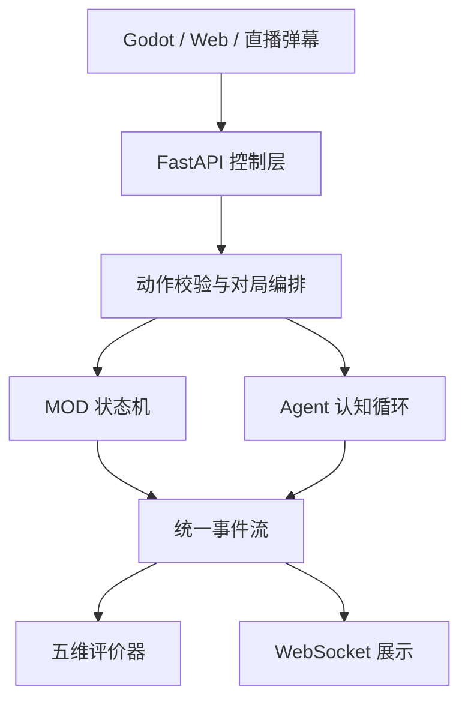

# 架构说明

## 运行边界

核心域不依赖 FastAPI 或 Godot。MOD 接收状态、行动与可复现随机源，返回新状态和领域事件；这使规则可以独立测试、回放和部署。

Agent 认知循环为 `观察 → 世界模型 → 记忆检索 → 决策预测 → 合法性硬校验 → 结果记忆`。策略无权直接修改状态；即使未来接入远程 LLM，其输出仍只能从 MOD 给出的合法动作集合中选择。

每个 Agent 的私有上下文是独立分区。协作信息通过共享黑板以事实事件传播，私有记忆和推理不进入黑板。提示构建与 LLM Provider 均为可替换平台组件，详见 [LLM/上下文接入](LLM_INTEGRATION.md)。

## MOD 契约

实现 `GameMod` 需要提供：

- `initial_state`：生成完整初始状态
- `current_player_id`：给出行动者
- `legal_actions`：列出规范化合法行动
- `apply_action`：纯规则转换并产生领域事件
- `is_terminal` / `scores`：终局与跨模式可比较的成绩
- 可选 `public_state`：实现战争迷雾或私有信息
- 可选 `agent_action`：提供 MOD 基线策略

引擎只接受 `legal_actions` 中的完整 Action。API、弹幕和 Agent 共用这一边界，所以接入新的输入源不会绕开规则。

## MVP 选择理由

| MOD | 主要压力点 | 可验证能力 |
|---|---|---|
| 战术对决 | 空间、伤害、资源 | 空间状态与局部行动 |
| 赛车策略 | 随机天气、风险资源 | 随机过程与长期规划 |
| 辩论擂台 | 文本语义、观众支持 | 社交策略与文本状态 |
| 危机联合作战 | 共享目标、信任、协同增益 | Agent 协作与团队评价 |

三者刻意覆盖不同状态形态。下一批建议加入“宫廷政变”（隐藏信息、多方联盟）和“国际局势”（并行回合、长期持续世界），以暴露当前串行双人契约的边界。

## 已知 MVP 边界

- 对局暂存在单进程内存中，重启即清空
- Agent 为确定性/轻随机启发式策略，尚未接远程 LLM
- 弹幕入口已统一，但平台鉴权、签名、限流和投票窗口待实现
- WebSocket 只做状态广播，没有断线补偿和事件游标
- 评价指标需要真人实验校准，不能作为最终产品 KPI

## 数据驱动升级路径

1. 为事件增加持久化、评价版本和回放游标。
2. 抽象 `TurnPolicy`，加入并行、限时和异步行动窗口。
3. 抽象 `ObservationPolicy`，支持阵营、私有信息和观众视角。
4. 将 Agent 放入隔离进程，记录 token、延迟、成本和失败回退。
5. 用实验配置固定 MOD 版本、Agent 版本、随机种子与玩家分群。

评分 v2 在动作事件中记录变更状态键、行动前后分数和领先者；Agent 决策记录预期事件并在规则执行后验证。基准工具用相同种子交换双方席位，区分玩家身份偏差和规则先后手偏差。
