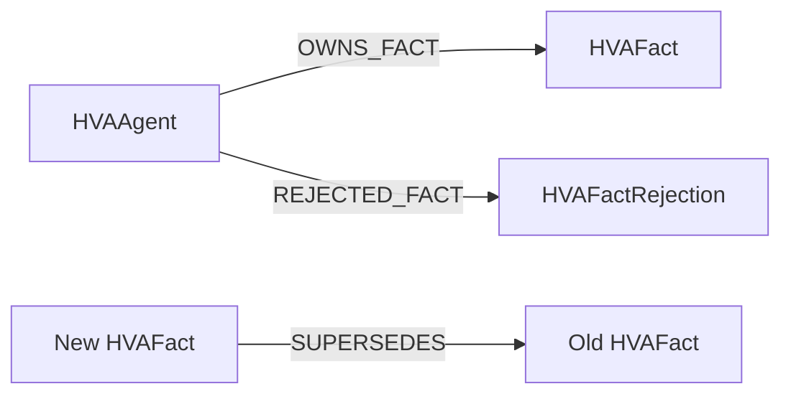

# Agent 事实图谱

事实图谱用于把“角色连续性”从提示词约定升级为引擎约束。图谱不负责替 Agent 决策；它负责回答：哪些内容已经是事实、哪些只是猜测、哪些可以改写、改写依据是什么。

## 事实类型

| 类型 | 示例 | 可改写 | 默认可见性 |
|---|---|---:|---|
| 核心身份 | 名字、身份披露、背景、愿望、创伤、价值观 | 否 | 表层公开，其余私有 |
| 形成性记忆 | 三段角色历史记忆 | 否 | 私有，剧情触发后揭露 |
| 运行状态 | 当前意图、心理矩阵、对手模式 | 是 | 私有 |
| 自由发挥 | 局部偏好、关系印象、传闻、背景细节 | 是 | 私有，需另行揭露 |

每条事实包含 `subject / predicate / object / confidence / source / visibility / status / revision`。核心事实标记为 `immutable`。

## 自由发挥和修订

模型只能提交候选事实：

```json
{
  "subject": "agent-id",
  "predicate": "history.backstory_detail",
  "object": {"detail": "..."},
  "basis_fact_ids": ["fact-0004"]
}
```

- 谓词必须在动态白名单中。
- 至少引用一个仍处于 active 状态的依据事实。
- 不允许写入 `identity.*` 或 `history.formative_memory.*`。
- 同一关系已有动态事实时，新事实必须显式提供 `supersedes_fact_id`。
- 被替代事实改为 `superseded`，不会删除，便于回放和审计。
- 拒绝的候选也记录原因，便于评价模型的事实约束能力。

## Neo4j 映射

Neo4j 适配器使用以下结构：



`HVAAgent.id` 和 `HVAFact.uid` 有唯一约束。事实对象以 JSON 保存，领域层仍是唯一写入校验入口。设置 `HVA_FACT_STORE=neo4j` 并提供 `HVA_NEO4J_URI / USER / PASSWORD / DATABASE` 即可启用。
