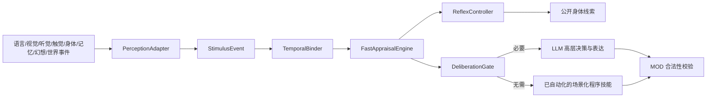

# 多模态刺激、反射与审慎思考门控

## 定位

本模块实现的是可测试的“隐式控制层”，不是对真实人类潜意识的科学等价声明。它解决两类问题：

1. 语言、视觉、声音、触觉、身体感受、回忆、幻想和世界事件可以先引起不受控的身体反应，角色之后才有机会解释或掩饰。
2. 已掌握的低风险操作可以使用程序经验和 MOD 基线在本地完成；只有新颖、冲突、高不确定或开放式社会语言场景才升级到 LLM。

## 运行链路



反射先于审慎决策形成。LLM 接到的上下文包含已经发生的可观察反应，可以掩饰、解释或顺势行动，但不能撤销反射事件。

## 输入和现实状态

`StimulusModality` 支持：

- `language`
- `vision`
- `audio`
- `touch`
- `interoception`
- `memory`
- `imagination`
- `world_event`

每条输入还必须保留独立的认识状态：

- `canonical`：权威世界事件；唯一可以作为新增权威事实的状态。
- `observed`：角色感知到的现象，可能不完整或误认。
- `remembered`：主观回忆，可以影响当前反应但不是新事实。
- `imagined`：幻想、梦境或心理预演。
- `inferred`：角色根据线索形成的推断。

`RealityStatusGuard` 明确禁止把后四类直接提升为身份或历史事实。幻想可以造成真实恐慌，但不能把“我担心女儿遇险”改写成“女儿已经被绑架”。

## 多输入融合

`TemporalBinder` 只绑定短序列窗口内的刺激。融合使用最大强度加受限的多模态增益，而不是无界相加：

- 重复的 `action_applied` 和领域事件不会被当成两次独立创伤。
- 不同模态和不同因果组可以产生有限复合增益。
- 总增益上限固定，所有输出保持在标准范围内。

## 快速评价与反射

快速评价只计算威胁、社会威胁、个人相关性、记忆共振、行动准备、歧义和审慎压力，不直接选择 MOD 动作。反射控制器根据这些连续变量产生最多两个低层线索，并具备：

- 冷却时间，避免每轮重复同一小动作；
- 习惯化，重复触发会逐步减弱；
- 人格与当前压力调节；
- 有限随机扰动，由对局随机源控制，可回放；
- 模糊解释契约，任何身体线索都不是测谎结果。

公开事件 `agent_involuntary_cue` 只包含可观察的动作、通道、强度和延迟；真实触发标签、记忆共振和受抑制线索只写入所属 Agent 的 `agent_reflex_diagnostic` 私有事件。

## LLM 门控

`DeliberationGate` 综合：

- 当前刺激的新颖性、歧义、个人相关性和复合模态；
- 是否属于开放式社会语言；
- 持续计划是否刚刚重建；
- 当前是否合法动作第一次出现；
- 程序技能所处阶段、成功置信度和当前场景是否熟悉；
- Agent 当前处于习惯还是审慎模式。

首个陌生世界快照、尖锐社会语言、重大重规划和高审慎压力会调用 Provider。只有已经进入 `automatic` 且当前场景也熟悉的动作可以跳过 Provider，并在 `llm_skip` 中记录原因、阈值和允许自动接管的动作索引。跳过 LLM 时，本地选择器也只能在这些索引中选择，不会借一个熟练动作的名义执行另一个陌生动作；所有动作仍经过 `legal_actions` 校验。

采访等开放语言 MOD 通常仍需 LLM 生成主要回答，成本收益主要来自非语言反应；战术、赛车和未来自由移动模式可以得到更高的调用削减。

## 动态技能自动化

后天熟练技能与惊跳、躲避等先天反射分开存储。`SkillLearningSystem` 使用五个阶段：

- `novel`：没有执行证据，需要查询、问路、示范或规划；
- `guided`：正在高层指导下练习；
- `practiced`：已有稳定经验，但尚不能完全接管；
- `automatic`：全局成功证据和当前场景熟悉度都越过门槛；
- `degraded`：连续失败、规则变化或高惊讶使高层重新接管。

当前保守基线要求至少五次执行、校准后成功置信度不低于 0.72、至少三次连续成功；具体场景还必须至少练习三次。一次成功不会变成“写死的 NPC 规则”。例如 `navigate` 在“家—车站”路线可以自动化，但首次出现“酒店—医院”仍返回高层求助；新路线练熟后才能单独接管。连续失败会降级，重新训练后可以恢复。

技能记录属于 owner-scoped 的 `procedural_skill` 长期记忆，只保存动作、场景描述、成功/失败、惊讶与控制来源，不保存思维链。使用稳定 `memory_owner_id` 和 SQLite 时可跨局恢复；新人物默认不会继承别人的技能。

MOD 默认以动作类型作为技能族，并从稳定的 `location/route/job/task/toolset/vehicle/environment_version` 等字段构建场景。导航、工作或复杂操作 MOD 应覆盖 `agent_skill_id` 与 `agent_skill_context`，避免把不同路线、设备或岗位误当成同一熟练场景。

## 接入新感知源

可信后端适配器可以调用：

```python
engine.publish_stimulus(
    match_id,
    target_agent_id=agent_id,
    modality="audio",
    semantic_tags=("alarm", "danger"),
    source_id="world",
    intensity=0.8,
    urgency=0.9,
    reality_status="observed",
)
```

这个入口只向下一次 Agent 观察发布事件，不修改 MOD 状态和事实图谱。视觉、听觉、触觉等上游适配器应优先发送权威游戏语义事件，而不是持续把原始帧或完整音频交给 LLM。

## 评价字段

`ai_capability_profile.implicit_control` 当前记录：

- 刺激接地率和实际覆盖模态；
- 快速评价与审慎门控覆盖率；
- 可观察反射率、反射是否先于决策；
- 身体线索模糊解释契约；
- 现实状态隔离率；
- Provider 跳过率。
- 技能诊断覆盖率、指导决策数、本地自动接管率、新场景重新求助数和阶段迁移。

这些是架构和事件证据，不能替代真人对戏剧自然度、线索重复、文化差异和可读性的盲评。
