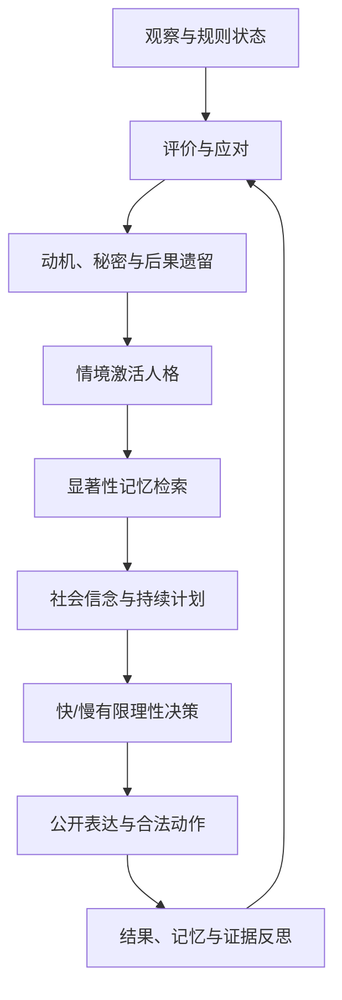

# 研究驱动的人类感 Agent 架构

## 目标与边界

本引擎追求的是：玩家能观察到一个跨回合连续、受经历影响、会误判也会修正、
情绪与表达并非完全同一、同时仍遵守游戏规则的虚构角色。它不把语言流畅度当作
“等同真人”的证据，也不要求或保存模型的私密思维链。

“像真人”在本项目中必须拆成可证伪的行为假设：相似处应在盲评、跨回合一致性、
记忆消融和负面对照中成立；不成立的部分必须作为模型局限报告，不能用角色文案掩盖。

## 论文到引擎的映射

| 研究 | 可复用原理 | 引擎实现 | MVP-5 指标/验证 |
|---|---|---|---|
| [Generative Agents](https://arxiv.org/abs/2304.03442) | 记忆流按相关性、时近性、重要性检索；观察、计划、反思共同影响可信度 | `MemorySystem.retrieve`、重要性阈值反思、持续计划 | 记忆检索依据、反思证据率、计划持续/重规划 |
| [CoALA](https://arxiv.org/abs/2309.02427) | 工作、情景、语义、程序记忆分工；决策循环结构化 | 四类记忆契约，情景经历、语义反思、程序行动价值分离 | 记忆类型覆盖和实际影响率 |
| [Reflexion](https://proceedings.neurips.cc/paper_files/paper/2023/hash/1b44b878bb782e6954cd888628510e90-Abstract-Conference.html) | 结果反馈可形成可复用的语言反思，无需修改模型权重 | 累计显著性触发反思；每条反思必须引用 memory ID | 无证据反思不得计分 |
| [EMA appraisal dynamics](https://www.sciencedirect.com/science/article/abs/pii/S1389041708000314) | 情绪来自持续的评价、应对和再评价，不是直接从事件映射固定表情 | 新颖性、目标一致性、可控性、责任、规范和社会威胁评价 | 评价—情绪连贯性；平坦/随机情绪均扣分 |
| [InCharacter](https://aclanthology.org/2024.acl-long.102/) | 人格忠实度应通过心理访谈测量，而非只测知识或语气 | Big Five、稳定身份、逆风采访心理维度 | 人格稳定、身份连续、访谈盲评 |
| [PersonaGym](https://arxiv.org/abs/2407.18416) | 动态情境中的人格表现需要独立评价；模型更大不等于人设更忠实 | 稳定特质经当前威胁、合作、不确定性和利害激活 | 情境特质激活率与跨情境可辨识度 |
| [EmoCharacter](https://aclanthology.org/2025.naacl-long.316/) | 情绪忠实度是独立于知识和人格的能力 | 内在心理、应对方式、公开表达分离 | 内外表达差值与多轮情绪轨迹 |
| [SOTOPIA](https://openreview.net/forum?id=mM7VurbA4r) | 社会智能需在开放互动中综合考察目标和关系 | 对他人的信任、尊重、敌意、真诚度和意图预测 | 社会信念更新、合作/对抗结果 |
| [LifelongSOTOPIA](https://openreview.net/forum?id=XdcuqZRhjQ) | 单局表现不能证明长期社会一致性 | 计划、社会信念和语义反思采用跨回合结构 | 后续加入跨局人格与关系连续性实验 |
| [Self-report-grounded agents](https://arxiv.org/abs/2411.10109) | 个人叙事和自述可改善对人格、实验和经济博弈行为的预测 | 自传记忆、价值观、创伤、愿望进入私有身份层 | 身份解释、个人叙事消融、角色可辨识度 |
| [R-CHAR](https://aclanthology.org/2025.emnlp-main.1372/) | 元认知与自适应评价有助于角色和认知一致性；冗长思维不必然更好 | 简短可审计摘要、可修订反思、显式重规划理由 | 元认知证据率，不采集私密思维链 |
| [Memory-Driven Role-Playing](https://aclanthology.org/2026.findings-acl.1175/) | 长对话中“记住”和“真正应用”角色记忆是不同问题 | 决策只注入检索结果，并分别记录检索和影响 | `memory_retrieval_grounding` 与 `memory_influence_rate` 分开 |
| [Character is Destiny / LIFECHOICE](https://aclanthology.org/2025.findings-emnlp.813/) | 角色理解应落实为根据前文与人物状态预测下一项关键抉择，而不只是模仿口吻 | 结构化人物决策卡、通用动机冲突模型、冻结标签防泄漏测试 | 决策匹配、动机排序、歧义—置信度校准 |
| [NARRABENCH](https://aclanthology.org/2026.eacl-long.176/) | 既有基准对视角、揭露、事件和风格等叙事能力覆盖不足 | 叙事校准与对局总分分离，显式记录秘密压力和弧光；不宣称覆盖完整叙事能力 | 能力缺口与数据局限必须随报告输出 |
| [CharacterBox](https://aclanthology.org/2025.naacl-long.323/) | 动态环境和多 Agent 互动要持续更新人物状态 | `NarrativeDynamics` 接收事件评价与行动后果，产生跨回合迟滞 | 后果迟滞、人物弧光变化 |
| [CHATTER](https://aclanthology.org/2025.wnu-1.11/) | 影视角色属性应由人工验证，并与纯语言表面区分 | 人格、动机、情绪评价和选择分别评分；后续接入许可标注 | 属性标注一致性仍待独立复核 |
| [OpenToM](https://aclanthology.org/2024.acl-long.466/) | 自然叙事中的行动需要动机与心理状态共同解释 | 决策卡同时记录利害、控制感、他人责任和情绪锚点 | 评价—情绪拟合与选择解释 |

补充研究方向包括动态第一人称社会推理的
[EgoSocialArena](https://arxiv.org/abs/2410.06195)、情绪轨迹与情绪记忆的
[Sentipolis](https://aclanthology.org/2026.findings-acl.368.pdf)，以及高道德冲突角色忠实度的
[On the Failure of LLMs to Role-Play Villains](https://aclanthology.org/2026.findings-acl.282.pdf)。
最后一项意味着“阴暗角色忠实度”必须单独测试；它不意味着解除真实世界伤害、安全、
隐私或游戏规则边界。

## MVP-5 认知循环

### 记忆和反思

- 工作记忆只保留当前观察与本轮检索项。
- 情景记忆记录事件、行动、结果、惊讶、情绪效价和重要性。
- 语义反思是可修订信念，不进入不可变身份事实；必须引用情景记忆 ID。
- 程序记忆保存行动的经验价值，只作为偏好，不绕过 MOD 合法动作。
- 检索分数由时近性、重要性、词汇相关性和情绪一致性组成；不再简单尾切全部历史。

### 情绪、人格和表达

- 事件先产生评价：新颖性、目标一致性、可控性、他人责任、规范兼容和社会威胁。
- 评价选择应对倾向，再影响压力、愤怒和恐惧；下一轮可重新评价。
- Big Five 是稳定先验，但只有当前情境会激活相应特质，避免每回合重复同一性格标签。
- 公开表达受显示规则影响。克制、掩饰、讨好或放大愤怒都允许形成适度内外差异；
  永远完全一致或完全随机都不被视为更像真人。

### 社会推理、计划和有限理性

- 每个对手/队友的信任、尊重、熟悉度、敌意、真诚度和预测意图是可错的信念，
  不写入权威事实图谱。
- 计划默认持续；预测失败、目标严重不一致或应对过载时才重规划，并记录理由。
- 高压力或低思考必要性进入习惯模式；高不确定、高利害且仍可思考时进入审慎模式。
- 决策含可控噪声和程序习惯，但规则引擎始终做最终合法性校验。

### 动机冲突、后果迟滞与人物弧光

- 人物不是七个固定策略之一，而是多个动机、承诺、关系和成本在当前处境下竞争；策略只是合法动作空间中的表达手段。
- 单轮压力属于快变量；怨恨、羞耻、道德创伤、希望、依恋和身份失调属于慢变量，只有事件与行动后果才能渐变。
- 同一人格在相同表面局面下，可以因为此前受辱、失败、背叛或修复经历而做出不同选择。
- 人物弧光由慢变量阈值涌现，不允许语言模型直接宣告“我已成长”来改写状态。
- 这些内部状态只能偏置合法动作，不能越过 MOD 规则、事实图谱或安全边界。

## 评价和负面对照

MVP-5 保留六维总分，在 `ai_human_likeness` 中加入：

1. 记忆检索是否有依据、是否真正影响决策；
2. 反思是否引用情景证据；
3. 评价与情绪变化是否方向一致；
4. 社会信念是否随互动渐变；
5. 稳定人格是否由情境激活；
6. 计划是否合理持续或有理由地重规划；
7. 内在情绪和公开表达是否存在适度、可解释的差值。
8. 是否存在强弱适中的竞争动机，而不是永远只有一个支配目标；
9. 已发生后果是否以渐变方式影响后续偏好；
10. 身份与行动冲突时是否产生可观察的失调，而不是自动合理化清零。

自动化负面对照至少包括平坦重复角色、无差别随机波动、无证据反思、每回合重置计划、
永远选择效用最大值，以及不受情境影响的固定人格。最终发布门槛必须再加入真人双盲 A/B：
将 MVP-3、MVP-4、MVP-5、真人脚本和随机/平坦对照混排，评价角色一致、自然程度、情绪因果、
社会理解、决策可信、故事吸引力和是否愿意继续互动；不能只问“你觉得它是不是人”。

著名文学与影视人物只构成另一条 `narrative_character_fidelity` 证据链。内置 13 例原型集使用原创转述、无剧本/字幕/对白，且明确标为作者设计而非独立标注。其高分只能说明当前机制能重现这些设计卡，不能替代真实玩家实验。数据、版权门禁、负面对照和校准状态见 [叙事人物决策校准](NARRATIVE_CHARACTER_CALIBRATION.md)。

## 仍未证明的事项

- 当前自动分是架构与行为代理指标，不是“达到真人水平”的结论。
- 基线反思是确定性可审计实现；真实 LLM 的语言质量与事实遵守需单独运行 Provider 实验。
- 两人短局不能验证数十小时的身份连续、关系记忆和跨 MOD 迁移。
- 训练语料偏差、讨好行为、文化差异和真人多样性不能靠单一人格量表解决。
