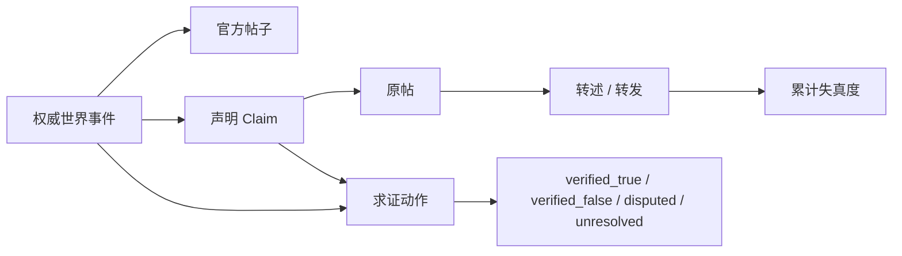

# 社交媒体兼容层

`hva_engine.social_media` 是 MOD 无关的手机社交平台层。小镇只提供两份配置：微博式 `town_weibo` 和短视频式 `town_short_video`；核心帖子、声明、转述、评论和求证逻辑不依赖小镇状态，其他 MOD 可以换成国际新闻流、宫廷密报网、公司内网或赛车车迷社区。

## 平台适配契约

`SocialPlatformAdapter` 只要求：

- 稳定平台 ID 和展示名；
- `manifest()`：格式、字数、排序和能力；
- `normalize_content()`：平台特有的内容限制。

`ConfiguredSocialPlatform` 已支持配置 `microblog / short_video`，能力标签包括发布、转发、评论、声明和事实核查。MOD 的 `manifest()` 会公开 `social_platforms`，前端无需写死平台名称。

Feed 排序可以接收当前观察者对不同作者的关系/信任权重，并与新鲜度、互动量、官方标记和争议度共同计算。因此同一时刻不同 Agent 不再看到完全相同的信息环境。平台兼容层维护公开账号资料；Agent 自己的来源信任、浏览历史和声明信念仍保存在 owner-scoped 私有上下文中。

## 信息不是事实

帖子和世界事实使用两条不同的数据链：

每次转述保留 `parent_post_id`、完整 `provenance`、`source_event_ids`、`claim_id` 和累计 `distortion`。Agent 浏览到帖子只会获得“有人这样说”的观察；不会把声明写入 `_knowledge` 或事实图谱。只有显式 `verify_claim` 找到与命题存在“支持”或“反驳”关系的证据后，公开状态才更新验证结论；仅仅主题相关的事件仍返回 `unresolved`，不会借助引擎隐藏真值作弊。兼容层用私有 `_evidence.supports / _evidence.refutes` 保存权威事实关系，MOD 可在新调查、公告或更正出现时用 `attach_evidence()` 动态追加。私有 `_truth_status` 与 `_evidence` 永远由 `public_state` 移除。

`appraise_report()` 只根据公开验证状态、转述失真、来源信任和溯源结构产生可信度/不确定性线索，不读取隐藏真值。Agent 私有信念记录接受度、未知度、曝光次数和独立根来源；同一原帖的多次转发不会被误算成多个独立消息源。核查成功后，Agent 会提高可靠来源的私人信任，降低错误来源的信任。

## 小镇动作

- `check_phone`：读取某个平台排序后的有限 feed；
- `publish_post`：引用自己已知的世界事件发布内容；
- `reshare_post`：保留父链，未核实转发会增加失真度；
- `comment_post`：质疑来源、讨论立场或补充信息；
- `verify_claim`：在已有现场/公告证据或图书馆检索条件下求证。
- `investigate_claim`：前往现场或查阅原始档案，生成新的观察证据，再交给求证步骤判定。

每个 Agent 只在 `_social_knowledge` 中保存自己看过的帖子和声明。其他人的发帖事件不会直接进入其上下文，必须通过手机 feed 观察。社交媒体状态可以随世界快照持久化，但各 Agent 的查看历史仍是私有会话状态，长期影响进入各自 owner 的记忆系统。

基线 Agent 还有短暂的数字注意力恢复期，刚浏览完手机不会立刻再次刷新；真实 LLM 仍在每次可用窗口内自主选择浏览、忽略、发布、讨论、调查或求证，导演器不会按固定日程强迫使用平台。

## 其他 MOD 接入

MOD 创建一个 `SocialMediaHub`，在初始状态保存 `hub.initial_state()`，然后把平台声明通过 `social_platform_manifest()` 暴露。MOD 决定何时把领域事件镜像成帖子、哪些动作允许求证，以及权威证据是什么；兼容层不猜测游戏规则，也不允许帖子绕过 MOD 改写事实。
